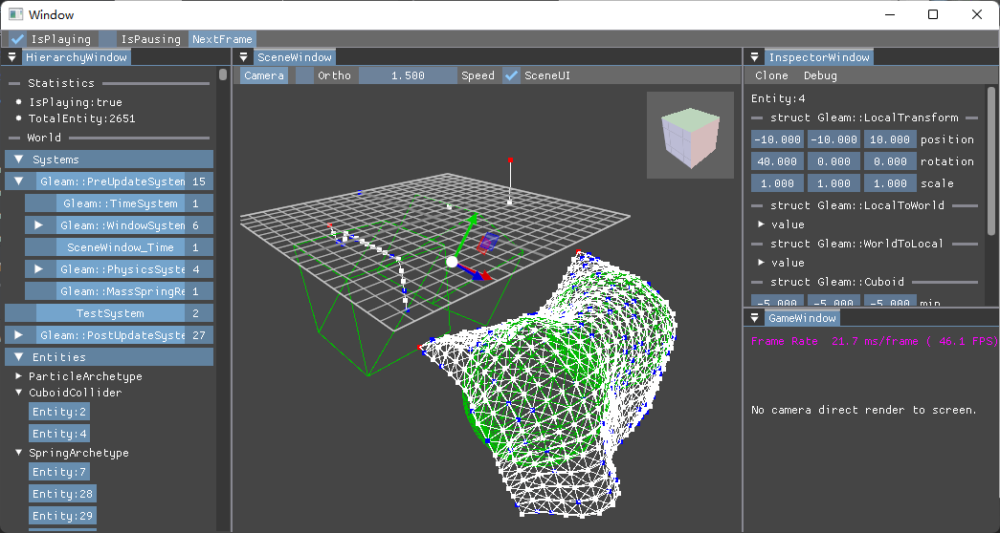

# Gleam

Gleam 中文名“微光”，是一款个人为学习用途而搭建的游戏引擎。

**_“微光”两字包含了我对该引擎的一些个人情感。光的含义有很多，如“希望”，“方向”，“点亮”，微则代表了它的体量。此外该名称与我的中文网名“半点星光”很匹配，而我的第一款游戏引擎“BDXK”其实也只是“半点星空”的汉语拼音首字母缩写。因此这款引擎叫微光太合适了。_**



---

**（请注意！Gleam 尚在成长阶段，API 很不稳定，很多功能也尚未完成。）**

## 特点

- 纯库实现，引擎代码实时编译，随见随改。
- 高度模块化，自由装配各种功能，引擎极易解构。
- 支持运行时和编辑器两种模式。
- 支持打包，轻松剥离编辑器代码。
- 采用 ECS 代码框架。
- 支持跨平台（尚未实现）

## 功能

### 库

- `GleamECS`：ECS 框架实现。
- `GleamGL`：vulkan 接入。
- `GleamGraphics`：现代图形框架实现。
- `GleamImport`：各类资源文件导入。
- `GleamMath`：各种数学功能实现。
- `GleamReflection`：反射和序列化实现。
- `GleamUtility`：辅助实用工具库。

### 模块

- `GleamEngine`：搭建引擎基本框架。
- `GleamWindow`：接入窗口和用户输入。
- `GleamPresentation`：接入图像渲染流程。
- `GleamUI`：接入用户界面功能。
- `GleamRendering`：实现主流渲染框架功能。
- `GleamMassSpring`：简易物理引擎实现。

## 开始

### 运行微光示例

想要运行微光引擎，你需要按以下步骤进行配置：

1. 安装微光项目必要的两个开发工具

   - cmake（项目生成工具）
   - vcpkg（外部库管理器）

   安装时要确保将它们加入了环境变量中，此外 vcpkg 要设置 `VCPKG_ROOT` 环境变量（vpckg 安装目录）。

2. 使用 `build.bat`（注意用管理员模式启动）生成构建系统项目（后续更新项目时也请用该批处理，且你可以从终端调用来加快工作流程）

3. 生成的构建系统项目中，所有项目被解决方案文件夹分为如下结构：

   - samples：示例项目，演示如何接入微光引擎。

     如`HelloGleam`，一个非常简单的利用引擎框架输出“Hello Gleam!”的示例。

   - sources：引擎核心代码。

     - libraries：不需要引擎框架可单独使用的库项目。（为的是与 modules 分离以便模块化开发）

       如`GleamMath`，一个部分仿照 hlsl 编写的数学库，可以单独使用甚至单独作为一个开源项目。

     - modules：基于引擎框架构建的库项目，接入微光引擎本质就是编译这些库。

   首次使用你可以先查看 samples 中的项目，然后是 sources 中每个库附带的 Tests 项目，这些也是可执行项目，你可以把它们当成对每个库的使用示例。

### 创建微光项目

若要创建自己的微光项目，建议参考 `HelloGleam` 的项目结构。

1. 首先你需要在微光引擎文件夹中创建一个空文件夹作为你的项目目录，并为你的目录创建 `CMakeLists.txt` 文件，接着使用 `ProjectCreate.cmake` 中的宏来创建项目（该文件不需要显式导入，引擎会处理这些）。

   示例文件如下：

   ```cmake
   # Gleam/MyProject/CMakeLists.txt
   # 创建一个可执行项目，项目名为当前文件夹名，项目文件为当前文件夹内所有文件。
   addProject()
   # 接入微光引擎模块，“GleamEngineRuntime”是最基本的微光引擎模块。
   linkLibrary(GleamEngineRuntime ${ProjectName})
   ```

2. 在项目中创建一个 cpp 文件并通过`main`函数调用`Engine::Start()`来启动微光引擎。（未来你也可以选择用`Gleam_Main`宏来简化上述代码，因为所有游戏代码实际可以完全基于 Gleam 框架，而无需写在`main`函数中）。

   示例文件如下：

   ```cpp
   // Gleam/MyProject/main.cpp
   #include <GleamEngine/Runtime/Engine.h> //引入 Gleam 的 Engine 功能
   int main()
   {
      Gleam::Engine::Start(); //运行 Gleam
      return 0;
   }
   ```

3. 接着重新生成微光引擎的构建系统项目，引擎的 `CMakeLists.txt` 会自动扫描添加所有子目录项目（当然就包括了我们的新建项目），并处理各种引擎依赖（如生成`__init__.cpp`文件（用于初始化引擎模块），复制依赖的`Resources`文件夹（非代码的资源文件））。

4. 重新加载构建系统项目，在里面找到我们新建的项目，接下来，编译并开始你的微光之旅。

### 使用微光引擎

微光引擎采用 ECS 作为程序的基本架构。在 ECS 中，数据和逻辑被分离，数据由 `Component` 定义并采用 `Entity` 管理，逻辑则使用 `System`。

在微光中，ECS 框架被具体为了如下几个类：

- `World`：静态类，存储着所有`Entity`和`System`信息，包括`Entity`关联的数据，你需要调用该类的函数来管理 ECS 资源。
- `Archetype`：实例类，每个实例存储一组`Component`类型信息，其决定了`Entity`对应数据的布局和存储位置。
- `Entity`：数字类型编号，用于关联一段数据以及这段数据的布局信息。
- `System`：抽象实例类，这些类可以被分组并具有顺序，用于接收来自引擎的更新事件。微光自带的大部分`System`都是单例，以便用户访问它们的功能。

所以为了在微光中执行自己的代码，必须利用`System`机制实现。

1. 由于`System`是抽象类，所以需要先继承实现该类，然后创建该类的实例。
2. 通过`main`函数，在引擎运行前将实例注册到`World`中，以接收`World`事件。
3. `System`可以接收几种`World`事件。通过覆盖同名虚函数，即可间接执行我们的代码。

示例代码如下：

```cpp
// Gleam/MyProject/main.cpp
#include <GleamEngine/Runtime/Engine.h> //引入 Gleam 的 Engine 功能
#include <GleamECS/Runtime/World.h>// 引入World功能
#include <iostream>

class MySystem : public Gleam::System// 实现System类
{
    void Start() override//自定义Start事件
    {
        std::cout << "Hello Gleam!" << std::endl;
    }
};
inline MySystem System = MySystem();//创建MySystem实例

inline int main()
{
    Gleam::World::AddSystem(&System);// 在引擎运行前添加System到World，以避免丢失前几帧的事件。
    Gleam::Engine::Start(); //运行 Gleam
    return 0;
}
```

当然，实际使用中，上述代码会使用`Gleam_Main`、`AddSystems`等宏简化，以便更舒适的在微光框架下工作，具体可以参见其他示例或测试项目的实现。

---

## 入门简介

1. Gleam 是一个由多个静态库构成的游戏引擎，开发者通过接入这些静态库并编译来运行引擎。
2. 引擎代码高度模块化，上述的每个静态库都是一个功能模块，并利用 cmake 实现了类似包管理的机制。
3. 这些模块都存在 sources 文件夹中，开发者可以单独引用或附加引用这些模块，来自行实现或扩展功能。
4. 针对每个模块，通常都具有以下内容结构：
   - Runtime：引擎核心代码，用户运行时必备。
   - Editor：基于 Runtime 开发编辑器功能，便于开发者使用。
   - Tests：用于检测模块问题的单元测试。
5. 查看 samples 文件夹中的示例项目，获知如何正确使用该引擎。

## 环境依赖

- cmake：构建系统
- vcpkg：包管理器

## 为什么我需要 Gleam？

1. 我需要一个便于进行引擎底层运行原理研究的游戏引擎：

   虽然游戏引擎让游戏开发的门槛变得非常低，但当要进行一些特殊功能的开发缺乏底层知识是万万不行的，但很多教程对此都是一笔带过，这对我的进一步学习产生了阻碍，所以我必须得想办法搞懂这些。

2. 我想要一个真正源码随时可见随时可改的引擎：

   大部分引擎都是语言上的套壳引擎，C++ 写核心再用 C# 套一层，导致看源码很不方便也缺少反馈性。有说法是 C# 更简单易学所以使用 C# 套壳，但我认为只要不去深究 C++ 的复杂功能，C++ 也足够简单，而且很多学校也教。

3. 我想要一个足够简单易于扩展的引擎：

   市面上成熟的引擎都太复杂了，而我想要的引擎，它可能不支持先进的功能也没有强大的运行性能，但它一定足够简单直白，易于理解和修改它。甚至它可以不是一款游戏引擎，而是简化到成为了一种框架库，这样我才能更自由的用它发挥畅想。

4. 我想要一个开源引擎：

   闭源引擎无法知晓内部运行机制，出了问题也没法修复，而且在它们的基础上写代码会给我一种给人白打工还助其垄断的感觉。

## Gleam 将发展到哪一步？

1. Gleam 不仅是游戏引擎，Gleam 将成为我长久发展的研究基地：

   Gleam 的基本功能是一款可用于制作简单游戏的引擎，因为它诞生的一个目的就是为了让我研究游戏引擎的运行原理。但同时它也将成为我的个人 C++ 工具库、研究基地，这也是为什么必须将它高度模块化。未来如果有任何我感兴趣且需要 C++功能实现，我大概率都会以 Gleam 为基础开发。

2. Gleam 目前仅用于学习，故仅会制造有意义的轮子：

   时间是有限的，技术是垄断的，所以开发 Gleam 大概率只是生活的消遣而非生存的方式。开发 Gleam 是为了更好的使用其他商业引擎，故不能在上面耗费太多的精力，我只会造那些自己感兴趣有学习需要的轮子。因此 Gleam 将始终保持学生作业的水准，但这也是没有办法的事。
