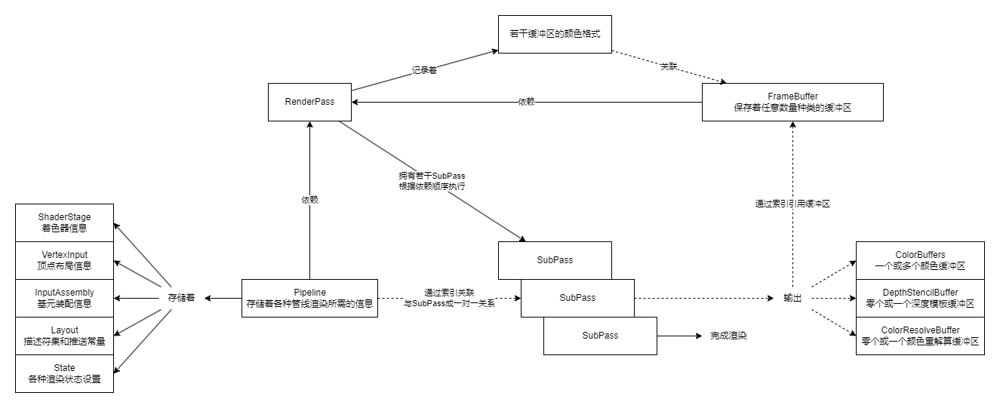

# GL 模块

封装 vulkan 图形接口，实现 RAII 并封装一些啰嗦或常用的代码，尽可能保持一个原生的 vk 体验。

## 注意点

### 关于 vulkan 中的坐标系

- 管线中的视口和剪刀状态都是右手坐标系，左上角为原点，右下角为帧缓冲区像素大小，
- 剪辑空间 x、y 依然是-1 到 1，但 y 以向下为正方向，这与其他图形 API 相反。
- 深度范围为 0-1，近端为 0，远端为 1，与 D3D 一致。
- vk 将纹理内存起点视作 uv 原点，但由于外部图像加载通常从左上开始，导致实际是(0,1)的区域被 vk 错认为(0,0),因此通常可以认为
  vk 中的 uv 空间也是右手坐标系。

备注：

- 上述右手坐标系指：x 向右，y 向下，z 向前。
-

具体各图形API的坐标系差异参考 [Vulkan/DirectX/OpenGL的坐标系差异以及实际工程中的处理方案](https://zhuanlan.zhihu.com/p/677941516)

## Vulkan的渲染框架

不使用动态渲染的话

若使用动态渲染：

1. 不需要再创建`RenderPass`和`FrameBuffer`。
2. 不支持多Pass，相当于仅能使用系统内置一个`Subpass`。
3. 渲染时需显式提供一个`Subpass`输出所需的各种缓冲区。
4. `Pipeline`不再依赖`RenderPass`，但要额外提供输出缓冲区格式信息。